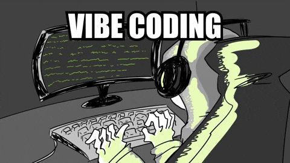

# Hi there, I'm Bunyaphon Chaimongkolsup (Bell) 👋

I am a student currently studying at IT KMITL , focused on building side projects and exploring new technologies.

> **Commit message of my life :**
> `git commit -m "Leave the past, refactor the future."`

### 🚀 Currently Learning
I am currently deep-diving into ai, cyber, web to expand my technical expertise and stay updated with industry trends.

### 🛠 Tech Stack

---

### 📫 Connect with me

 <table width="100%" border="0" cellspacing="0" cellpadding="0">
  <tr>
    <td align="left" valign="top">
      I'm always open to discussing projects or tech-related topics.  
      <ul>
        <li><b>Email:</b> <a href="mailto:bunyaphon536@gmail.com">bunyaphon536@gmail.com</a></li>
        <li><b>LinkedIn:</b> <a href="https://www.linkedin.com/in/%E0%B8%9A%E0%B8%B8%E0%B8%93%E0%B8%A2%E0%B8%B2%E0%B8%9E%E0%B8%A3-%E0%B8%8A%E0%B8%B1%E0%B8%A2%E0%B8%A1%E0%B8%87%E0%B8%84%E0%B8%A5%E0%B8%97%E0%B8%A3%E0%B8%B1%E0%B8%9E%E0%B8%A2%E0%B9%8C-99289a274/">My profile</a></li>
      </ul>
    </td>
    <td align="right" valign="bottom" width="150">
      
    </td>
  </tr>
</table>
